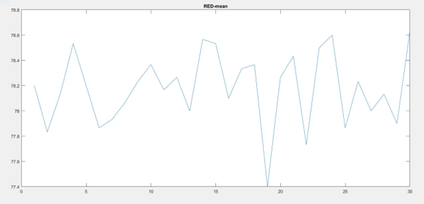
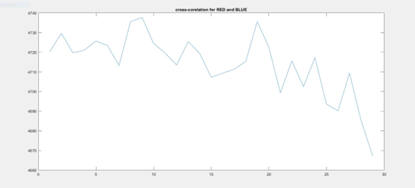

# Signal Processing of GY-31 Color Sensor

**Authors**: Luna Salameh, Zaid Nasser
**Institution**: High Institute of Applied Sciences and Technology, Electronic Systems Department  

---

## Introduction

This project involves signal processing for the GY-31 color sensor within the framework of a random processes course.  
The goal is to study sensor color measurements, evaluate stability, compute statistical parameters, and develop models for designing noise suppression filters.

---

## Tools and Equipment

- Arduino UNO
- GY-31 Color Sensor
- USB Cable
- Male-to-female wires  
**Software:** Arduino IDE, MATLAB

---

## Sensor Working Principle

- GY-31 (TCS3200) sensor uses photodiode matrix with red, green, blue filters.
- Outputs frequency signals proportional to color intensity.
- Compatible with 3V / 5V systems.

---

## Microcontroller Operation

- ATmega328 on Arduino UNO
- **Specs:**  
  - Operating voltage: 5V  
  - Input voltage: 7-12V  
  - Digital I/O: 14 (6 PWM)  
  - Analog inputs: 6  
  - Clock: 16 MHz  

---

## Experimental Procedure

- Connect sensor to Arduino, measure RGB intensities.
- Collect ~30 readings per color.
- Export to Excel → MATLAB for analysis.
- `pulseIn` measures frequency signals.

---

## Signal Analysis

**Example (Red signal)**  
Mean RED: 78.18  
Variance RED: 2.9  

Similar stats for green and blue signals.

---

## Autocorrelation and Stationarity

- Autocorrelation at lags τ = 0, 1, 3.
- Signals demonstrated wide-sense stationarity.

---

## Figures

  
*Red signal mean sample plot.*

  
*Autocorrelation at various lags.*

---

## Conclusion

The GY-31 sensor provided reliable measurements.  
Analysis confirmed stationarity properties, enabling future filter development.

